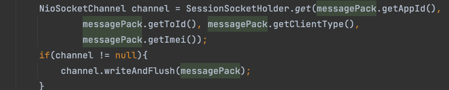

test hotfix
demo feature-001
brew install redis
Starting and stopping Redis using launchd
As an alternative to running Redis in the foreground, you can also use launchd to start the process in the background:

brew services start redis
This launches Redis and restarts it at login. You can check the status of a launchd managed Redis by running the following:

brew services info redis
If the service is running, you'll see output like the following:
URL:
https://redis.io/docs/getting-started/installation/install-redis-on-mac-os/

TCP 服务 调用 逻辑层的接口， 可先方式：

    1、HTTP   成熟 简单  调用速率比较慢。
    2、RPC 有成熟的 RPC 框架  接入比较复杂  流量大不能做到限流
    3、消息中间件
消息中间件 :RabbitMQ
Windows下安装RabbitMQ
https://www.cnblogs.com/yakniu/p/16183938.html

工作模式：

survive 存活  durable 持久化

7.9
注册中心
Eureka  Consul Kubernetes Nacos  Zookeeper

redis 保存 netty 服务

消息收发流程：
sdk  接入层 逻辑层  存储层
发信息给好友流程：  
1、发送端 给IM服务器 、IM服务器回ack 给发送端
2、IM 服务器发消息给同步的在线端
3、IM 服务器发消息给对方在线端

SessionSocketHolder  （netty session 容器）
BaseProcess.process() 处理消息， 发送消息

MessageProducer 生产消息
MessageReceiver 接收消息 
